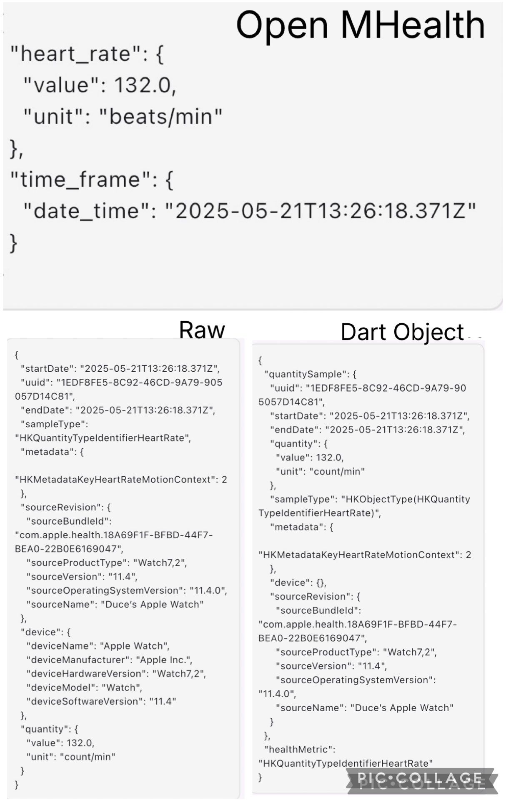
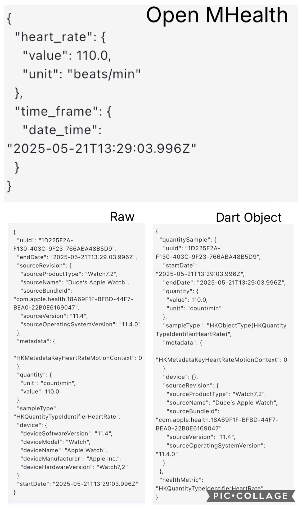
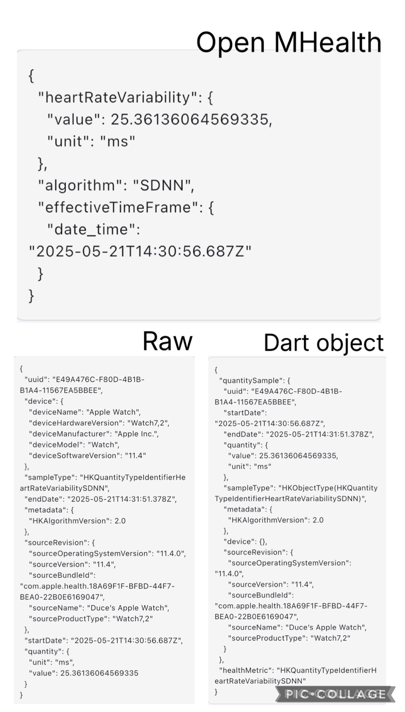
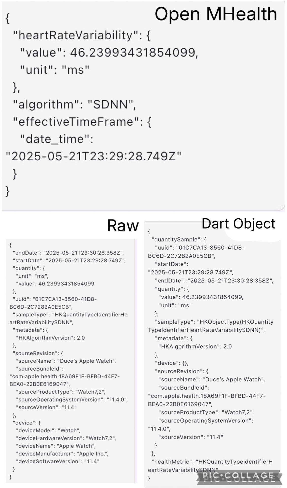

# Flutter Health Plugin Testing Protocol

## Test Information

| Field | Value           |
|-------|-----------------|
| Test ID | `TEST-DP01`     |
| Date | `2025-05-22`    |
| Time | `01:51`         |
| Tester Name | `Duc Anh Pham`  |
| Testing Location | `Vaxjo, Sweden` |
| Test Description | `Testing that the plugin can successfully extract and convert historical data for IOS infrastructure` |

## Device Configuration

| Field | Value                 |
|-------|-----------------------|
| Phone Model | `Iphone 13 Pro`       |
| OS Type | `[] Android  [X] iOS` |
| OS Version | `18.4.1`              |
| Flutter Plugin Version | `3.29.2`              |
| App Build Number | `0.0.1`               |

## Wearable Device

| Field | Value                                                  |
|-------|--------------------------------------------------------|
| Wearable Type | `[X] Smartwatch  [ ] Fitness Band  [ ] Other: _______` |
| Wearable Model | `Apple Watch Series 9`                                 |
| Firmware Version | `WatchOS 11.4`                                         |
| Connection Method | `[X] Bluetooth  [ ] WiFi  [ ] Other: _______`          |
| Wearable Battery Level | `100%`                                                  |

## Test Environment

| Field | Value                                                                    |
|-------|--------------------------------------------------------------------------|
| Physical Activity Type | `[X] Resting  [X] Walking  [ ] Running  [ ] Cycling  [ ] Other: _______` |
| Duration | `24 hours`                                                             |
| Intensity (if applicable) | `[X] Low  [ ] Medium  [ ] High`                                          |

## Health Data Parameters Tested

*Check all that apply:*

- [X] Heart Rate
- [X] Heart Rate Variability
- [ ] Other: _______

## Test Procedure

1. **Setup**
    - _Description of how the test environment was prepared_
   ```
      The test environment was prepared through charging the devices and preparing the necessary software to synchronize data between Apple Watch Series 9 and Apple HealthKit on IOS. The smartwatch was also
      inspected for any visible damage or hinder of sensors that might affect the ability to provide data. The Apple Watch Series 9 was then connected to the iPhone 13, which was linked to a Mac laptop to establish a synchronized development environment.

2. **Data Collection Process**
    - _Steps taken to collect the health data_
   ```
   The Apple Watch Series 9 was worn on the left wrist throughout the day to collect heart rate and heart rate variability data during resting and walking activities.
   Using HealthKit, the data is then synchronized between the recorded Apple Watch data and the Iphone 13 storage. After data was successfully synchronized and accessibly in the Iphones HealthKit storage.
   The experiment app was initialized to extract the data.
   ```

3. **Experiment app steps to collect data**
    - _In app navigation and steps to extract data
   ```
      Navigation steps in the experiments app:
      - Open up layout UI in top right corner
      - Click "Start Date" option, fill in 2025-05-21 12:00
      - Click "End Date" option, fill in 2025-05-22 12:00
      * Displayed: "Data Retrieval Module 605 records retrieved"
      - Click "Fetch Historical Data"
      - Open Menu in top left corner
      - Click Conversion Metrics
      * Displayed: "Conversion Module accuracy: 100%. Got 601 amount of heart rate records. 601 got validated. Got 4 amount of heart rate variability records. 4 got validated."
      - Open Menu in top left corner
      - Click "Performance Metrics"
      * Displayed: "Performance Module total time: 226ms. Fetching raw data took 226 ms. Conversion to openMhealth took 0ms. Converted 605 objects.
      - Open Menu in top left corner
      - Click "Inspect Data"
      - Click view JSON for Raw data, Converted object, Open Mhealth
      * Displayed: Each data object for corresponding format, view images for more details 
   ```

4. **Observations During Testing**
    - _Any notable observations during the testing process_
   ```
      The application, plugin and all hardware components worked smoothly throughout the entire process.
      
      A mismatch was observed between the timestamp fields in the fetched records and those in Apple HealthKit. This was accounted for due to timezone differences. Apple HealthKit stores timestamps in local time, whereas the plugin records them in UTC. The observed mismatches are due to this systematic timezone offset.
   ```

## Results

### Data Extraction Performance

| Metric | Result                                      | Notes |
|--------|---------------------------------------------|-------|
| Connection Success | `[X] Success  [ ] Partial  [ ] Failed`      | |
| Data Retrieval Completeness | `[X] Complete  [ ] Partial  [ ] Failed`     | |
| Extraction Speed | `239 milliseconds`                          | |
| Battery Impact (device) | `0% drain (test ran during charge)`     | |
| Battery Impact (wearable) | `0% drain`                                  | |
| App Stability | `[X] Stable  [ ] Minor Issues  [ ] Crashed` | |

### Data Validation

| Data Type              | Expected Value | Actual Value  | Matches?         | Expected Timestamp | Actual Timestamp   | Matches?         | Notes                                | Image reference in app    | Image reference in HealthKit                |
|------------------------|----------------|---------------|------------------|--------------------|--------------------|------------------|--------------------------------------|---------------------------|---------------------------------------------|
| Heart rate             | 132 beats/min  | 132 beats/min | `[X] Yes [ ] No` | 21-05-25 15:26     | 21-05-25 13:26     | `[ ] Yes [X] No` | Did not match due to timezone offset |||
| Heart rate             | 110 beats/min  | 110 beats/min | `[X] Yes [ ] No` | 21-05-25 15:29     | 21-05-25 13:29     | `[ ] Yes [X] No` | Did not match due to timezone offset |||
| Heart rate variability | 25 ms          | 25 ms         | `[X] Yes [ ] No` | 21-05-25 16:31     | 21-05-25 14:31     | `[ ] Yes [X] No` | Did not match due to timezone offset |||
| Heart rate variability | 46 ms          | 46 ms         | `[X] Yes [ ] No` | 22-05-25 01:29     | 21-05-25 23:29     | `[ ] Yes [X] No` | Did not match due to timezone offset |||


### Results Report

*Attach screenshot or link to the formal results report generated by the test software*


## Issues Encountered

| Issue | Severity | Description | Reproducible? |
|-------|----------|-------------|--------------|
| None observed | `[ ] Low [ ] Medium [ ] High [ ] Critical` | No issues occurred during testing. | `[ ] Yes [X] No [ ] Sometimes` |

## Additional Notes

```
   The test was repeated multiple times to ensure validity and consistency for the data records.
```

## Conclusion

**Test Result:** `[X] Pass  [ ] Pass with Issues  [ ] Fail`

**Recommendations for Improvement:**
```
Although the timestamp mismatches were expected and accounted for, consider aligning the plugin's timestamps with HealthKit’s local time format to improve clarity and reduce potential confusion.

```

---

## Follow-up Actions

| Action Item | Assigned To | Due Date | Status |
|-------------|-------------|----------|--------|
| None required| - |  - | `[ ] Open [ ] In Progress [ ] Completed [X] None` |

---

*Protocol version: 1.0*