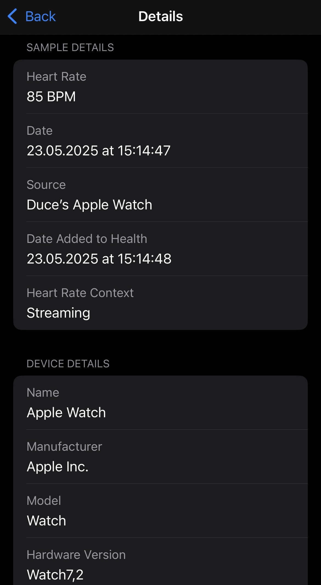

# Flutter Health Plugin Testing Protocol

## Test Information

| Field | Value           |
|-------|-----------------|
| Test ID | `TEST-DP02`     |
| Date | `2025-05-23`    |
| Time | `15:09`         |
| Tester Name | `Duc Anh Pham`  |
| Testing Location | `Vaxjo, Sweden` |    

## Device Configuration

| Field | Value                 |
|-------|-----------------------|
| Phone Model | `Iphone 13 Pro`       |
| OS Type | `[] Android  [X] iOS` |
| OS Version | `18.4.1`              |
| Flutter Plugin Version | `3.29.2`              |
| App Build Number | `0.0.1`               |

## Wearable Device

| Field | Value                                                  |
|-------|--------------------------------------------------------|
| Wearable Type | `[X] Smartwatch  [ ] Fitness Band  [ ] Other: _______` |
| Wearable Model | `Apple Watch Series 9`                                 |
| Firmware Version | `WatchOS 11.4`                                         |
| Connection Method | `[X] Bluetooth  [ ] WiFi  [ ] Other: _______`          |
| Wearable Battery Level | `100%`                                                  |

## Test Environment

| Field | Value                                                                    |
|-------|--------------------------------------------------------------------------|
| Physical Activity Type | `[X] Resting  [] Walking  [ ] Running  [ ] Cycling  [ ] Other: _______` |
| Duration | `10 minutes`                                                             |
| Intensity (if applicable) | `[X] Low  [ ] Medium  [ ] High`                                          |

## Health Data Parameters Tested

*Check all that apply:*

- [X] Heart Rate
- [ ] Heart Rate Variability
- [ ] Other: _______

## Test Procedure

1. **Setup**
    - _Description of how the test environment was prepared_
   ```
      The test environment was prepared through charging the devices and preparing the necessary software to synchronize data between Apple Watch Series 9 and Apple HealthKit on IOS. The smartwatch was also
      inspected for any visible damage or hinder of sensors that might affect the ability to provide data. The Apple Watch Series 9 was then connected to the iPhone 13, which was linked to a Mac laptop to establish a synchronized development environment.

2. **Data Collection Process**
    - _Steps taken to prepare for the data collection process_
   ```
      The Apple Watch Series 9 was worn on the left wrist with the "Heart Rate" app open during a ten minute period to collect heart rate data while seated and resting.
      Using HealthKit, the data is then synchronized between the recorded Apple Watch data and the Iphone 13 storage. The experiment app was at the same time initialized and attempted real time data fetches.
   ```

3. **Observations During Testing**
    - _Any notable observations during the testing process_
   ```
   ```

## Results

### Data Extraction Performance

| Metric | Result                                      | Notes |
|--------|---------------------------------------------|-------|
| Connection Success | `[X] Success  [ ] Partial  [ ] Failed`      | |
| Data Retrieval Completeness | `[X] Complete  [ ] Partial  [ ] Failed`     | |
| Extraction Speed | ` - `                          | |
| Battery Impact (device) | `0% drain (test ran during charge)`     | |
| Battery Impact (wearable) | `3% drain`                                  | |
| App Stability | `[X] Stable  [ ] Minor Issues  [ ] Crashed` | |

### Data Validation

| Data Type   | Expected Value | Actual Value  | Matches?         | Expected Timestamp | Actual Timestamp   | Matches?         | Notes | Image reference in app                        | Image reference in HealthKit                         |
|-------------|----------------|---------------|------------------|--------------------|--------------------|------------------|-------|-----------------------------------------------|------------------------------------------------------|
| Heart rate  | 85 beats/min   | 85 beats/min  | `[X] Yes [ ] No` | 13:14 UTC+2        | 15:14 UTC          | `[X] Yes [ ] No` | -     |       |  |
| Heart rate  | 76 beats/min   | 76 beats/min  | `[X] Yes [ ] No` | 13:15 UTC+2        | 15:15 UTC          | `[X] Yes [ ] No` | -     |       |  |
| Heart rate  | 64 beats/min   | 64 beats/min  | `[X] Yes [ ] No` | 13:15 UTC+2        | 15:15 UTC          | `[X] Yes [ ] No` | -     |       |  |
| Heart rate  | 73 beats/min   | 73 beats/min  | `[X] Yes [ ] No` | 13:16 UTC+2        | 15:16 UTC          | `[X] Yes [ ] No` | -     |       |  |


### Results Report

*Attach screenshot or link to the formal results report generated by the test software*


## Issues Encountered

| Issue | Severity | Description | Reproducible? |
|-------|----------|-------------|--------------|
| None observed | `[ ] Low [ ] Medium [ ] High [ ] Critical` | No issues occurred during testing. | `[ ] Yes [] No [ ] Sometimes` |

## Additional Notes

```
   The same testprocess was repeated multiple times before this official test to ensure validity.
```

## Conclusion

**Test Result:** `[X] Pass  [ ] Pass with Issues  [ ] Fail`

**Recommendations for Improvement:**
```

```

---

## Follow-up Actions

| Action Item | Assigned To | Due Date | Status |
|-------------|-------------|----------|--------|
| None required| - |  - | `[ ] Open [ ] In Progress [ ] Completed` |

---

*Protocol version: 1.0*