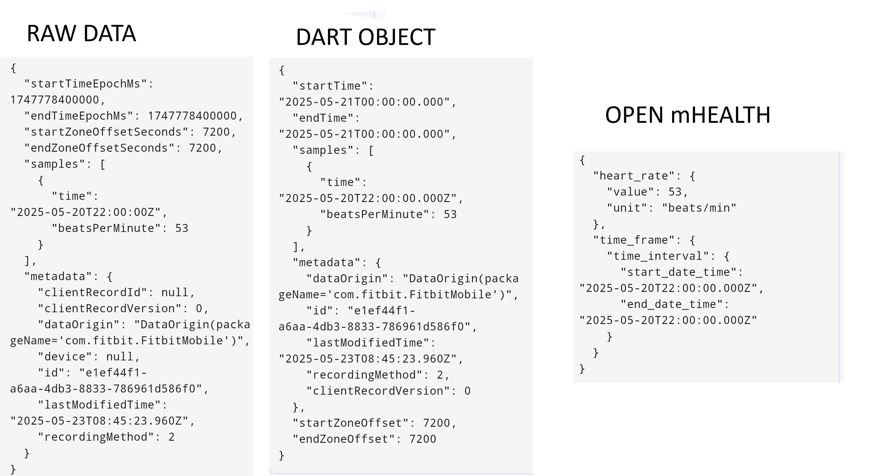
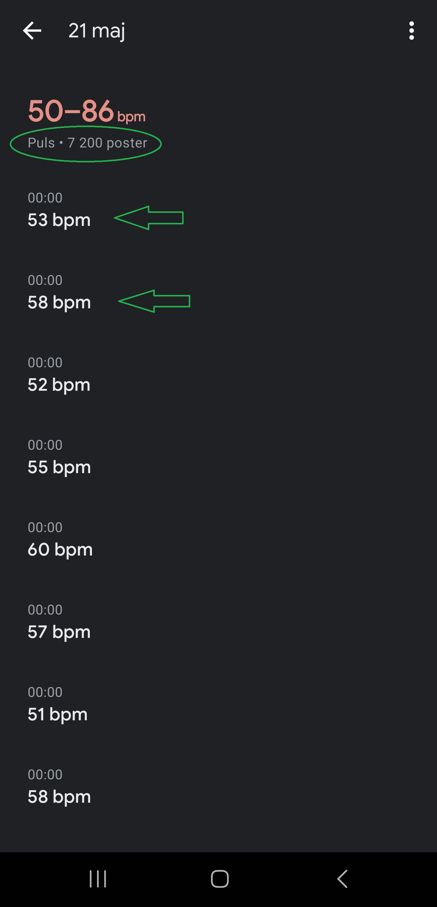
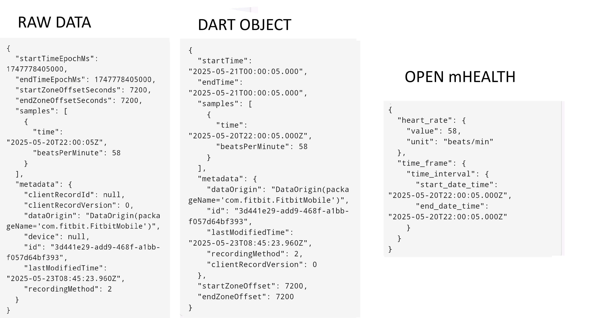
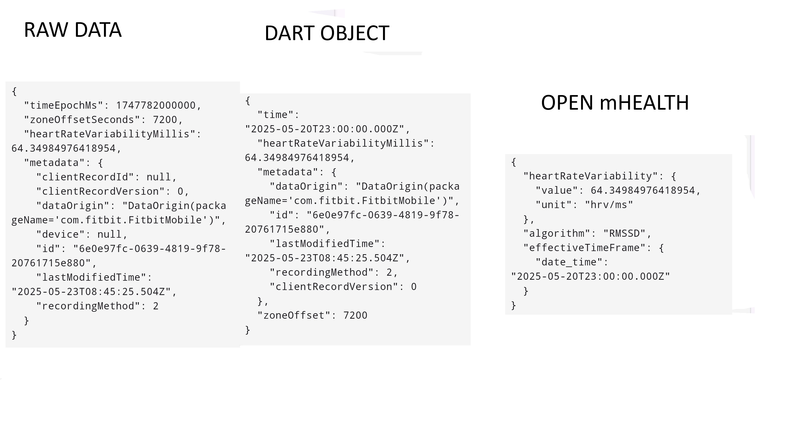
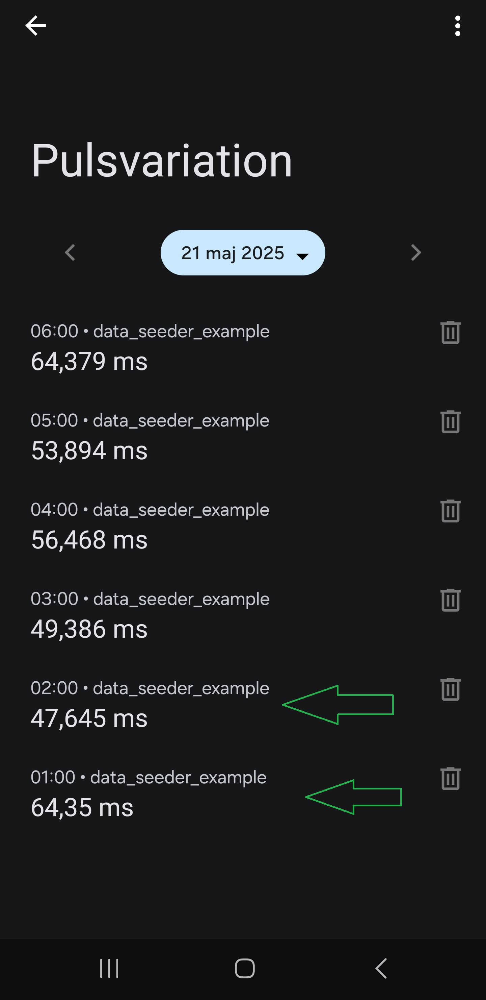
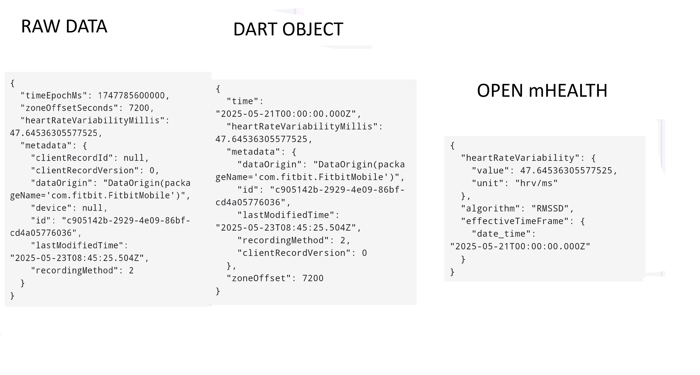
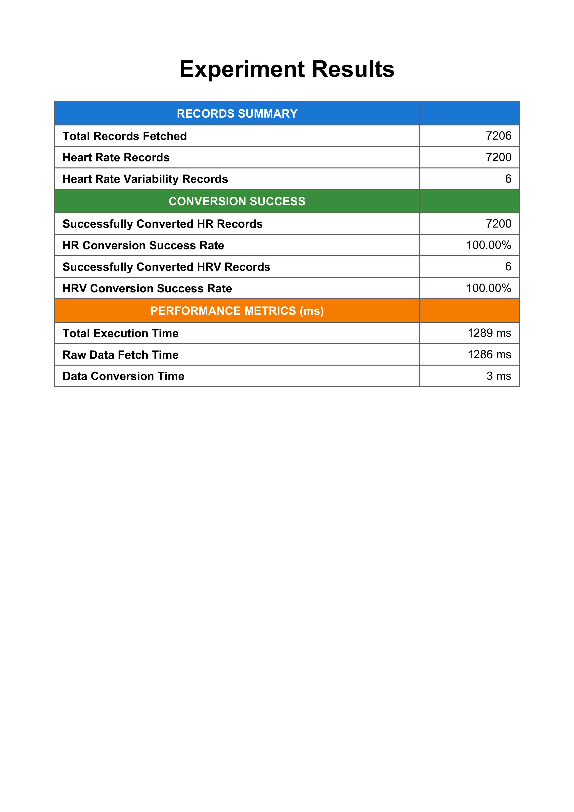

# Flutter Health Plugin Testing Protocol

## Test Information

| Field | Value               |
|-------|---------------------|
| Test ID | `TEST-GN02`         |
| Date | `2025-05-21`        |
| Time | `00:00`             |
| Tester Name | `Gustav Näslund`    |
| Testing Location | `Stockholm, Sweden` |

## Device Configuration

| Field | Value                      |
|-------|----------------------------|
| Phone Model | `Samsung Galaxy S22 Ultra` |
| OS Type | `[X] Android  [ ] iOS`     |
| OS Version | `14`                       |
| Flutter Plugin Version | `3.29.2`                   |
| App Build Number | `0.0.1`                    |

## Wearable Device

| Field | Value                                                  |
|-------|--------------------------------------------------------|
| Wearable Type | `[X] Smartwatch  [ ] Fitness Band  [ ] Other: _______` |
| Wearable Model | `Fitbit Sense 2`                                       |
| Firmware Version | `60.20001.194.86`                                      |
| Connection Method | `[X] Bluetooth  [ ] WiFi  [ ] Other: _______`          |
| Wearable Battery Level | `96%`                                                  |

## Test Environment

| Field | Value                                                                    |
|-------|--------------------------------------------------------------------------|
| Physical Activity Type | `[X] Resting  [X] Walking  [ ] Running  [ ] Cycling  [ ] Other: _______` |
| Duration | `10 hours`                                                               |
| Intensity (if applicable) | `[X] Low  [ ] Medium  [ ] High`                                          |
| Environmental Conditions | `Temperature: 9°C, Humidity: 28%, Other factors: _______`                |

## Health Data Parameters Tested

*Check all that apply:*

- [X] Heart Rate
- [X] Heart Rate Variable 
- [ ] Other: _______

## Test Procedure

1. **Setup**
    - _Description of how the test environment was prepared_
   ```
      The Fitbit Sense 2 smartwatch was visually inspected for any physical damage or obstructions to its sensors that could potentially interfere with data collection. The device was confirmed to be adequately charged (96%) prior to the test commencement and was securely attached to the tester's left wrist. The necessary mobile applications, including the Fitbit app, Google Fit (for visual data verification), and the 'plugin experiment app' (v0.0.1), were ensured to be installed and configured on the Samsung Galaxy S22 Ultra.
   ```

2. **Data Collection Process**
    - _Steps taken to collect the health data_
   ```
      Health data (Heart Rate and Heart Rate Variability) was captured by the Fitbit Sense 2 overnight, between approximately 23:00 and 10:00. Post-recording, the data was synchronized from the smartwatch to the Fitbit mobile application on the Samsung Galaxy S22 Ultra. The Fitbit app was configured to share its data with Google's Health Connect. After allowing time for this synchronization, the 'plugin experiment app' was launched to initiate the extraction of the relevant health data from Health Connect for the defined period.

   ```

3. **Observations During Testing**
    - _Any notable observations during the testing process_
   ```
      The Fitbit Sense 2 was worn as intended on the left wrist from approximately 23:00 to 10:00 to specifically capture nocturnal Heart Rate (HR) and Heart Rate Variability (HRV), as the latter is primarily recorded by Fitbit devices during sleep. Synchronization of data from the watch to the Fitbit app, and subsequently to Health Connect, proceeded smoothly. Google Fit provided a convenient way to visually confirm that data was populating Health Connect as expected. A manual data sanitization step was performed within Health Connect to remove any entries outside the designated 23:00-10:00 test window, ensuring the dataset's integrity.
   ```

## Results

### Data Extraction Performance

| Metric | Result                                      | Notes |
|--------|---------------------------------------------|-------|
| Connection Success | `[X] Success  [ ] Partial  [ ] Failed`      | |
| Data Retrieval Completeness | `[X] Complete  [ ] Partial  [ ] Failed`     | |
| Extraction Speed | `1289 ms`                             | |
| Battery Impact (device) | `1% drain`                                  | |
| Battery Impact (wearable) | `0-1% drain`                                | |
| App Stability | `[X] Stable  [ ] Minor Issues  [ ] Crashed` | |

### Data Validation

| Data Type              | Expected Value | Actual Value  | Matches?         | Expected Timestamp | Actual Timestamp   | Matches?         | Notes                                | Image reference in app    | Image reference data store                |
|------------------------|----------------|---------------|------------------|--------------------|--------------------|------------------|--------------------------------------|---------------------------|---------------------------------------------|
| Heart rate             | 53 beats/min  | 53 beats/min | `[X] Yes [ ] No` | 21-05-21 00:00 UTC+2     | 21-05-20 22:00 UTC   | `[X] Yes [] No` | -  |||
| Heart rate             | 58 beats/min  | 58 beats/min | `[X] Yes [ ] No` | 21-05-21 00:00 UTC+2    | 21-05-20 22:00:05 UTC      | `[X] Yes [X] No` | - |||
| Heart rate variability | 64,349849764 ms          | 64,349849764 ms         | `[X] Yes [ ] No` | 21-05-21 01:00 UTC+2     | 21-05-20 23:00UTC     | `[X] Yes [] No` | - |||
| Heart rate variability | 47,64536305577525 ms          | 47,64536305577525 ms         | `[X] Yes [ ] No` | 22-05-21 02:00 UTC+2     | 21-05-21 00:00 UTC     | `[X] Yes [] No` |  |||

### Results Report

*Attach screenshot or link to the formal results report generated by the test software*



Alternative link to report: [Report Link](url_or_path)

## Issues Encountered

| Issue | Severity | Description | Reproducible? |
|-------|----------|-------------|--------------|
| | `[ ] Low [ ] Medium [ ] High [ ] Critical` | | `[ ] Yes [ ] No [ ] Sometimes` |
| | `[ ] Low [ ] Medium [ ] High [ ] Critical` | | `[ ] Yes [ ] No [ ] Sometimes` |

## Additional Notes

```

```

## Conclusion

**Test Result:** `[X] Pass  [ ] Pass with Issues  [ ] Fail`

**Recommendations for Improvement:**
```

```

---

## Follow-up Actions

| Action Item | Assigned To | Due Date | Status |
|-------------|-------------|----------|--------|
| | | | `[ ] Open [ ] In Progress [ ] Completed` |
| | | | `[ ] Open [ ] In Progress [ ] Completed` |

---

*Protocol version: 1.0*