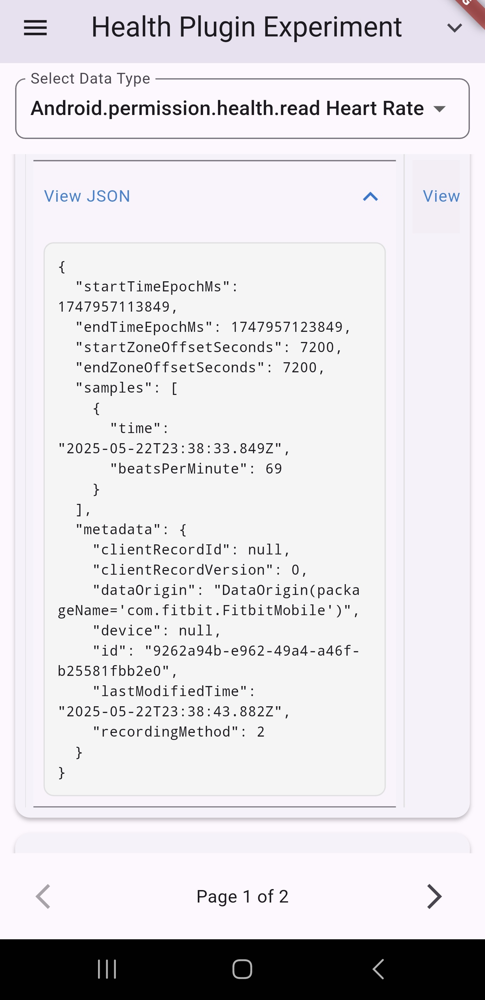
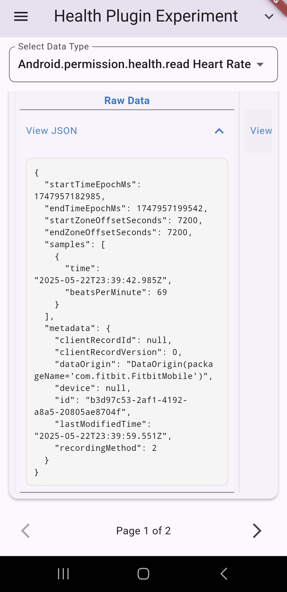
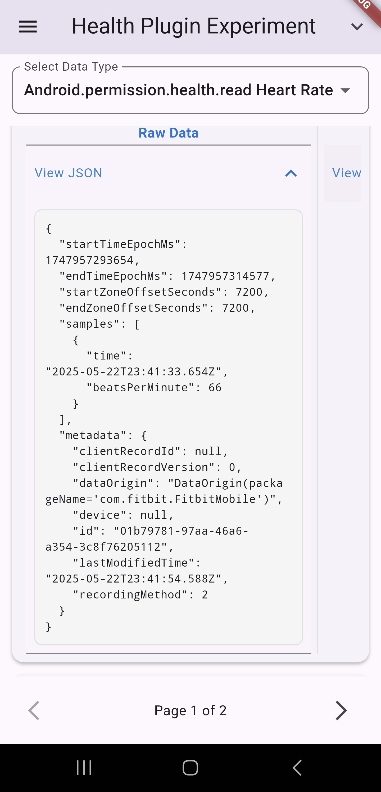
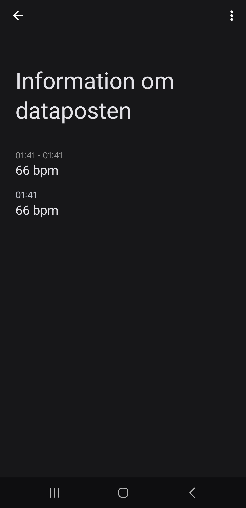
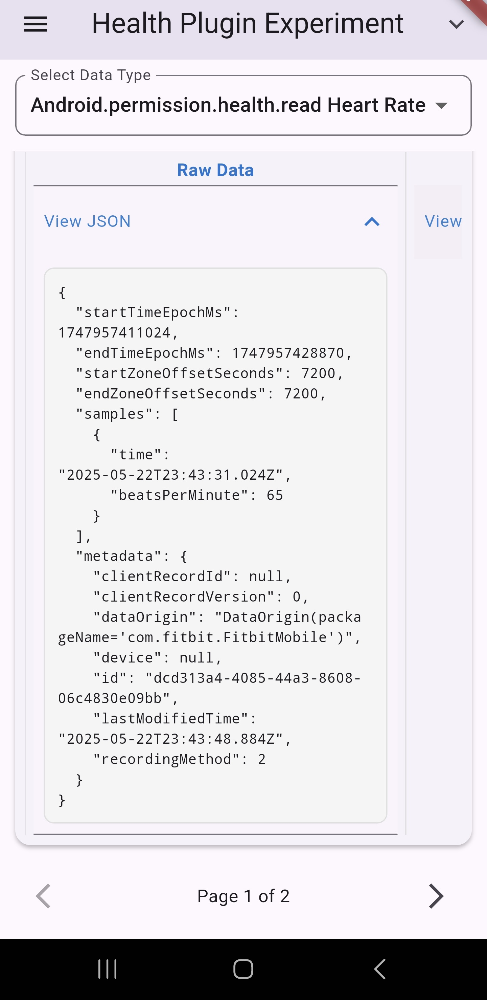
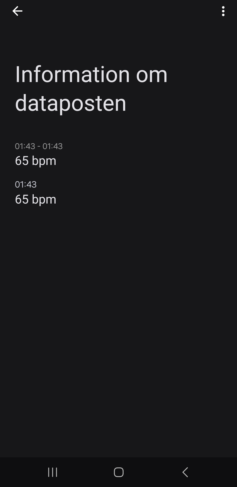

# Flutter Health Plugin Testing Protocol

## Test Information

| Field | Value        |
|-------|--------------|
| Test ID | `TEST-GN03`  |
| Date | `2025-05-23` |
| Time | `00:30`      |
| Tester Name | `Gustav Näslund`           |
| Testing Location | `Stockholm, Sweden`      |

## Device Configuration

| Field | Value                      |
|-------|----------------------------|
| Phone Model | `Samsung Galaxy S22 Ultra` |
| OS Type | `[X] Android  [ ] iOS`     |
| OS Version | `14`                       |
| Flutter Plugin Version | `3.29.2`                   |
| App Build Number | `0.0.1`                    |

## Wearable Device

| Field | Value                                                  |
|-------|--------------------------------------------------------|
| Wearable Type | `[X] Smartwatch  [ ] Fitness Band  [ ] Other: _______` |
| Wearable Model | `Fitbit Sense 2`                                       |
| Firmware Version | `60.20001.194.86`                                      |
| Connection Method | `[X] Bluetooth  [ ] WiFi  [ ] Other: _______`          |
| Wearable Battery Level | `96%`                                                  |

## Test Environment

| Field | Value |
|-------|-------|
| Physical Activity Type | `[X] Resting  [ ] Walking  [ ] Running  [ ] Cycling  [ ] Other: _______` |
| Duration | `10 minutes` |
| Intensity (if applicable) | `[X] Low  [ ] Medium  [ ] High` |
| Environmental Conditions | `Temperature: 24°C, Humidity: ___%, Other factors: _______` |

## Health Data Parameters Tested

*Check all that apply:*

- [X] Heart Rate
- [ ] Heart rate variability
- [ ] Other: _______

## Test Procedure

1. **Setup**
    - _Description of how the test environment was prepared_
   ```
   The test environment was prepared to ensure consistent and reliable data collection. This involved setting up the Samsung Galaxy S22 Ultra running the custom heart rate extraction application in a controlled indoor setting, minimizing potential interference and ensuring the equipment was configured for optimal performance prior to each session.
   ```

2. **Data Collection Process**
    - _Steps taken to collect the health data_
   ```
    The data collection process commenced with establishing a connection between the wearable device and its companion application on the designated smartphone. Subsequently, data synchronization was verified between the wearable's application and Google Health Connect to ensure seamless data flow. The smartwatch was then worn strictly according to the manufacturer's guidelines to promote accurate sensing. Once these preparatory steps were completed, the real-time heart rate data collection was initiated using the dedicated experiment application.
   ```

3. **Observations During Testing**
    - _Any notable observations during the testing process_
   ```
   
   ```

## Results

### Data Extraction Performance

| Metric | Result | Notes |
|--------|--------|-------|
| Connection Success | `[X] Success  [ ] Partial  [ ] Failed` | |
| Data Retrieval Completeness | `[X] Complete  [ ] Partial  [ ] Failed` | |
| Extraction Speed | `_____ seconds` | |
| Battery Impact (device) | `3% drain` | |
| Battery Impact (wearable) | `1% drain` | |
| App Stability | `[X] Stable  [ ] Minor Issues  [ ] Crashed` | |

### Data Validation

| Data Type | Expected Value | Actual Value |  Matches? | Expected timestamp | Actual timestamp | Matches | Notes |  Image ref app | Image ref HealthConnect |
|-----------|---------------|--------------|----------|-------|-----------|---------------|--------------|----------|-------|
| Heart rate | 69 | 69 | `[X] Yes [ ] No` | 01:38 UTC+2 | 23:38 UTC | `[X] Yes [ ] No` | - |  |  |
| Heart rate | 69 | 69 | `[X] Yes [ ] No` | 01:39 UTC+2 | 23:39 UTC | `[X] Yes [ ] No` | - |  |  |
| Heart rate | 66 | 66 | `[X] Yes [ ] No` | 01:41 UTC+2 | 23:41 UTC | `[X] Yes [ ] No` | - |  |  |
| Heart rate | 65 | 65 | `[X] Yes [ ] No` | 01:43 UTC+2 | 23:43 UTC | `[X] Yes [ ] No` | - |  |  |

### Results Report


## Issues Encountered

| Issue | Severity | Description | Reproducible? |
|-------|----------|-------------|--------------|
| | `[ ] Low [ ] Medium [ ] High [ ] Critical` | | `[ ] Yes [ ] No [ ] Sometimes` |
| | `[ ] Low [ ] Medium [ ] High [ ] Critical` | | `[ ] Yes [ ] No [ ] Sometimes` |

## Additional Notes

```

```

## Conclusion

**Test Result:** `[X] Pass  [ ] Pass with Issues  [ ] Fail`

**Recommendations for Improvement:**
```

```

---

## Follow-up Actions

| Action Item | Assigned To | Due Date | Status |
|-------------|-------------|----------|--------|
| | | | `[ ] Open [ ] In Progress [ ] Completed` |
| | | | `[ ] Open [ ] In Progress [ ] Completed` |

---

*Protocol version: 1.0*