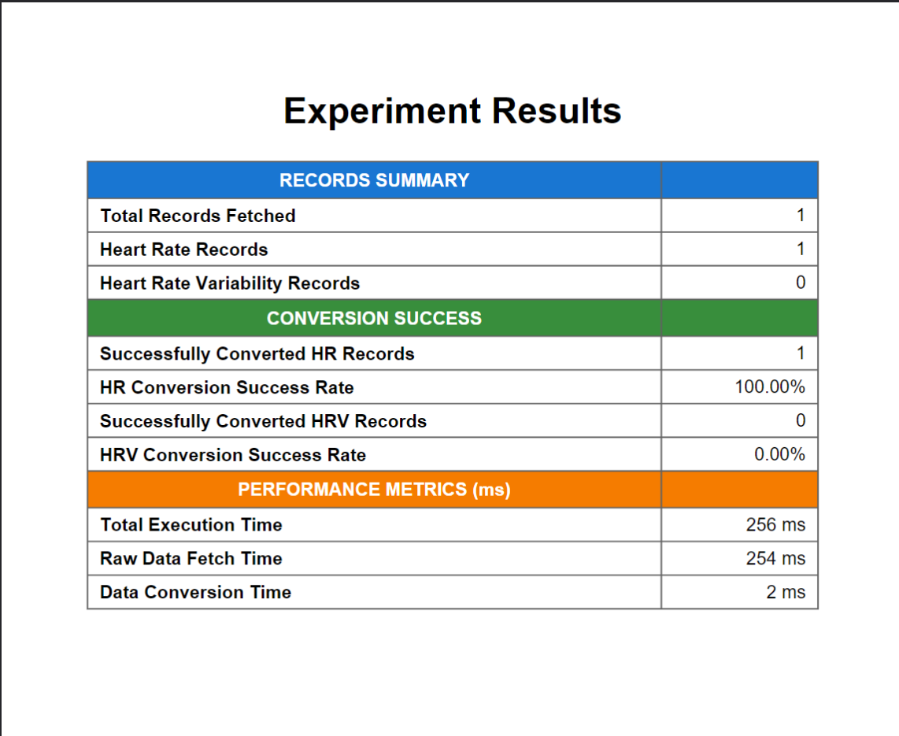

# Flutter Health Plugin Testing Protocol

## Test Information

| Field | Value               |
|-------|---------------------|
| Test ID | `TEST-GN01`         |
| Date | `2025-05-20`        |
| Time | `00:00`             |
| Tester Name | `Gustav Näslund`    |
| Testing Location | `Stockholm, Sweden` |

## Device Configuration

| Field | Value                      |
|-------|----------------------------|
| Phone Model | `Samsung Galaxy S22 Ultra` |
| OS Type | `[X] Android  [ ] iOS`     |
| OS Version | `14`                       |
| Flutter Plugin Version | `3.29.2`                   |
| App Build Number | `0.0.1`                    |

## Wearable Device

| Field | Value                                                  |
|-------|--------------------------------------------------------|
| Wearable Type | `[X] Smartwatch  [ ] Fitness Band  [ ] Other: _______` |
| Wearable Model | `Garmin Venu 2`                                        |
| Firmware Version | `19.05`                                                |
| Connection Method | `[X] Bluetooth  [ ] WiFi  [ ] Other: _______`          |
| Wearable Battery Level | `96%`                                                  |

## Test Environment

| Field | Value                                                                 |
|-------|-----------------------------------------------------------------------|
| Physical Activity Type | `[X] Resting  [X] Walking  [ ] Running  [ ] Cycling  [ ] Other: ____` |
| Duration | `24 hrs`                                                              |
| Intensity (if applicable) | `[X] Low  [ ] Medium  [ ] High`                                       |

## Health Data Parameters Tested

*Check all that apply:*

- [X] Heart Rate
- [ ] Heart rate variability
- [ ] Other: _______

## Test Procedure

1. **Setup**
    - _Description of how the test environment was prepared_
   ```
      The test environment was prepared through charging the devices and preparing the necessary software to synchronize data between Garmin Venu 2 and Google Health Connect on Android. The smartwatch was also
      inspected for any visible damage or hinder of sensors that might affect the ability to provide data. It was then paired with the Galaxy S22 Ultra via Bluetooth. Health Sync was used to facilitate synchronization. The phone was also connected to a development workstation to enable monitoring during testing.
   ```

2. **Data Collection Process**
    - _Steps taken to collect the health data_
   ```
      The plugin experiment app was installed on the Samsung Galaxy S22 aswell as Health Sync, which is a third party app
      needed for data synchronization between the Garmin Venu 2 and Health Connect. Then gathered data was synchronized using
      Health Sync from the smartwatch to the device. After synchronization of the registered data, The experiment was initialized
      using the experiment app for extraction of the data.
   ```

3. **Observations During Testing**
    - _Any notable observations during the testing process_
   ```
      The need for a third party software solution for synchronization of data between Garmin Venu 2 and Health Connect
      provides insight in the probable need for additional vendors within the plugin for more seamless integration and
      data extraction, even though the native abstraction also have value. The ability to extract heart rate variability values from 
      Garmin Venu 2 to Health Connect is limited by the third party software, even though the capbility to store and record
      heart rate variability data is present at both the recording device and the data store.
   ```

## Results

### Data Extraction Performance

| Metric | Result                                      | Notes |
|--------|---------------------------------------------|-------|
| Connection Success | `[X] Success  [ ] Partial  [ ] Failed`      | |
| Data Retrieval Completeness | `[X] Complete  [ ] Partial  [ ] Failed`     | |
| Extraction Speed | `256 milliseconds`                          | |
| Battery Impact (device) | `5% drain`                                  | |
| Battery Impact (wearable) | `0-1% drain`                                | |
| App Stability | `[X] Stable  [ ] Minor Issues  [ ] Crashed` | |

### Data Validation

| Data Type  | Expected Value | Actual Value | Matches?         | Notes         |
|------------|----------------|--------------|------------------|---------------|
| Heart rate | 63bpm          | 63bpm        | `[X] Yes [ ] No` | 00:00 - 00:02 |
| Heart rate | 70 bpm         | 70bpm        | `[X] Yes [ ] No` | 00:02 - 00:03 |
| Heart rate | 79 bpm         | 79bpm        | `[X] Yes [ ] No` | 00:03 - 00:05 |
| Heart rate | 72 bpm         | 72bpm        | `[X] Yes [ ] No` | 00:05 - 00:06 |

### Results Report

*Attach screenshot or link to the formal results report generated by the test software*



## Issues Encountered

| Issue | Severity | Description | Reproducible? |
|-------|----------|-------------|--------------|
| None observed | `[ ] Low [ ] Medium [ ] High [ ] Critical` | No issues occurred during testing. | `[ ] Yes [X] No [ ] Sometimes` |

## Additional Notes

```
   The test was repeated multiple times to ensure validity and consistency for the data records.
```

## Conclusion

**Test Result:** `[X] Pass  [ ] Pass with Issues  [ ] Fail`

**Recommendations for Improvement:**
```
(Skriv något om hur man kan göra så att man kan få hrv?)
```

---

## Follow-up Actions

| Action Item | Assigned To | Due Date | Status |
|-------------|-------------|----------|--------|
| None required| - |  - | `[ ] Open [ ] In Progress [ ] Completed [X] None` |

---

*Protocol version: 1.0*