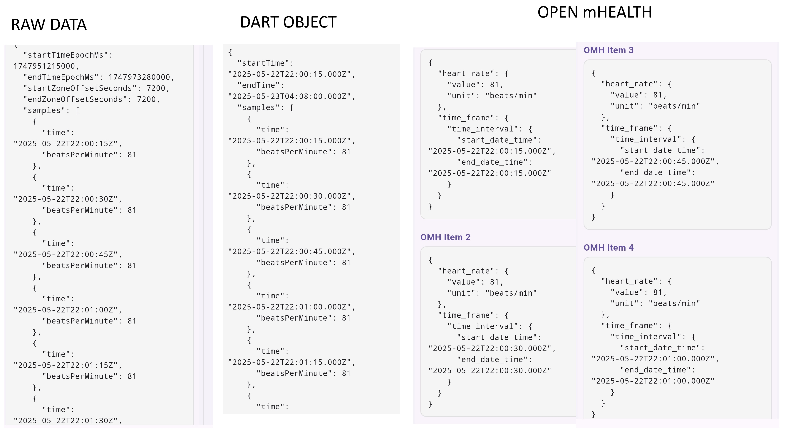
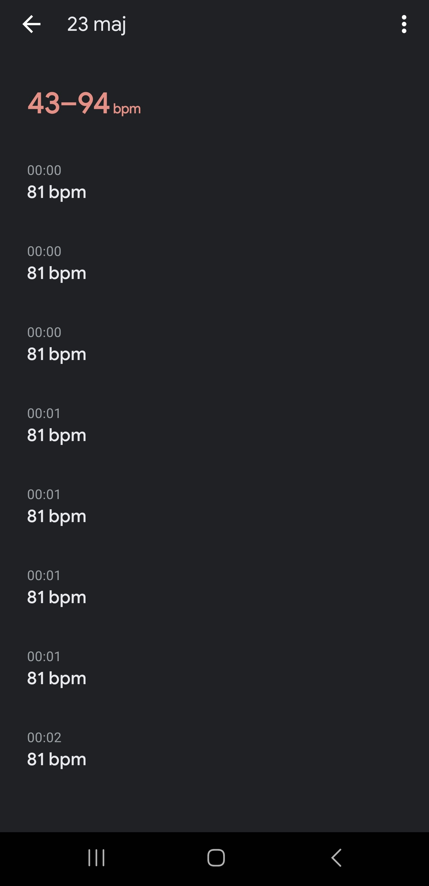
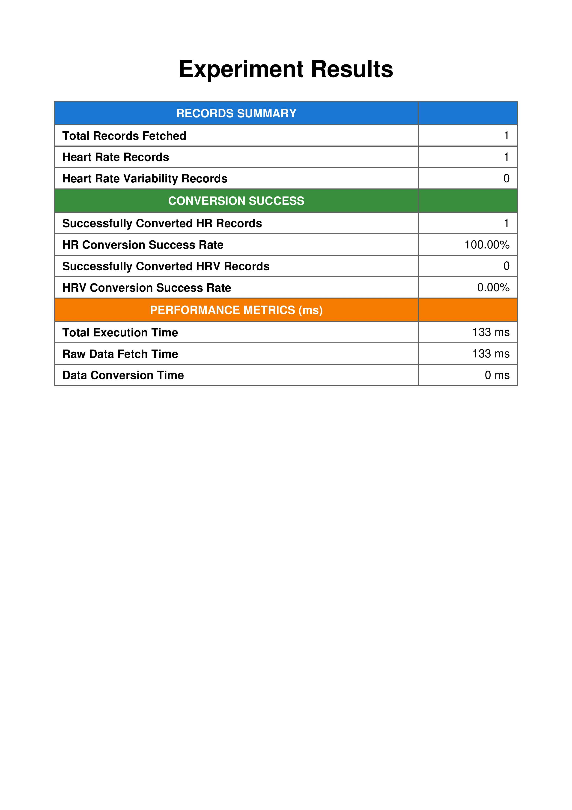

# Flutter Health Plugin Testing Protocol

## Test Information

| Field | Value               |
|-------|---------------------|
| Test ID | `TEST-GN01`         |
| Date | `2025-05-23`        |
| Time | `00:00`             |
| Tester Name | `Gustav Näslund`    |
| Testing Location | `Stockholm, Sweden` |

## Device Configuration

| Field | Value                      |
|-------|----------------------------|
| Phone Model | `Samsung Galaxy S22 Ultra` |
| OS Type | `[X] Android  [ ] iOS`     |
| OS Version | `14`                       |
| Flutter Plugin Version | `3.29.2`                   |
| App Build Number | `0.0.1`                    |

## Wearable Device

| Field | Value                                                  |
|-------|--------------------------------------------------------|
| Wearable Type | `[X] Smartwatch  [ ] Fitness Band  [ ] Other: _______` |
| Wearable Model | `Garmin Venu 2`                                        |
| Firmware Version | `19.05`                                                |
| Connection Method | `[X] Bluetooth  [ ] WiFi  [ ] Other: _______`          |
| Wearable Battery Level | `96%`                                                  |

## Test Environment

| Field | Value                                                                 |
|-------|-----------------------------------------------------------------------|
| Physical Activity Type | `[X] Resting  [] Walking  [ ] Running  [ ] Cycling  [ ] Other: ____` |
| Duration | `6 hrs`                                                              |
| Intensity (if applicable) | `[X] Low  [ ] Medium  [ ] High`                                       |
| Environmental Conditions | `Temperature: - °C, Humidity: - %, Other factors: _______`            |

## Health Data Parameters Tested

*Check all that apply:*

- [X] Heart Rate
- [ ] Heart rate variability
- [ ] Other: _______

## Test Procedure

1. **Setup**
    - _Description of how the test environment was prepared_
   ```
      The test environment was prepared through charging of devices and preparation of additional software needed for 
      the ability to synchronize data between garmin venu 2 and google health connect on android. The smartwatch was also
      inspected for any visible damage or hinder of sensors that might affect the ability to provide data.
   ```

2. **Data Collection Process**
    - _Steps taken to collect the health data_
   ```
      The plugin experiment app was installed on my Samsung Galaxy S22 aswell as Health Sync, which is a third party app
      needed for data synchronization between the Garmin Venu 2 and Health Connect. Then i synchronized gathered data via
      Health Sync from the smartwatch to the device. After synchronization of the registered data, i initialized the experiment
      within the experiment app for extraction of the data.
   ```

3. **Observations During Testing**
    - _Any notable observations during the testing process_
   ```
      The need for a third party software solution for synchronization of data between Garmin Venu 2 and Health Connect
      provides insight in the probable need for additional vendors within the plugin for more seamless integration and
      data extraction, even though the native abstraction also have value. The ability to extract heart rate variability values from 
      Garmin Venu 2 to Health Connect is limited by the third party software, even though the capbility to store and record
      heart rate variability data is present at both the recording device and the data store.
   ```

## Results

### Data Extraction Performance

| Metric | Result                                      | Notes |
|--------|---------------------------------------------|-------|
| Connection Success | `[X] Success  [ ] Partial  [ ] Failed`      | |
| Data Retrieval Completeness | `[X] Complete  [ ] Partial  [ ] Failed`     | |
| Extraction Speed | `133 milliseconds`                          | |
| Battery Impact (device) | `1% drain`                                  | |
| Battery Impact (wearable) | `0-1% drain`                                | |
| App Stability | `[X] Stable  [ ] Minor Issues  [ ] Crahed` | |s

### Data Validation

| Data Type  | Expected Value | Actual Value   | Matches?         | Expected Timestamp      | Actual Timestamp        | Matches?         | Notes |
|------------|----------------|----------------|------------------|-------------------------|-------------------------|------------------|-------|
| Heart rate | 81 beats/min   | 81 beats/min   | `[X] Yes [ ] No` | 21-05-22 22:00:15 UTC | 21-05-23 00:00:15 UTC+2 | `[X] Yes [] No`  | -     |
| Heart rate | 81 beats/min   | 81 beats/min   | `[X] Yes [ ] No` | 21-05-22 22:00:30 UTC | 21-05-23 00:00:30 UTC+2 | `[X] Yes [] No`  | -     |
| Heart rate | 81 beats/min   | 81 beats/min   | `[X] Yes [ ] No` | 21-05-22 22:00:45 UTC | 21-05-23 00:00:45 UTC+2 | `[X] Yes [] No`  | -     |
| Heart rate | 81 beats/min   | 81 beats/min   | `[X] Yes [ ] No` | 21-05-22 22:01:00 UTC | 21-05-23 00:01:00 UTC+2 | `[X] Yes [] No`  | -     |





### Results Report




Alternative link to report: [Report Link](url_or_path)

## Issues Encountered

| Issue | Severity | Description | Reproducible? |
|-------|----------|-------------|--------------|
| | `[ ] Low [ ] Medium [ ] High [ ] Critical` | | `[ ] Yes [ ] No [ ] Sometimes` |
| | `[ ] Low [ ] Medium [ ] High [ ] Critical` | | `[ ] Yes [ ] No [ ] Sometimes` |

## Additional Notes

```
   The necessity of using a third party application for extraction of data makes the validity and reliability of this test hard to evaluate. The correctness is uncertain.
```

## Conclusion

**Test Result:** `[X] Pass  [ ] Pass with Issues  [ ] Fail`

**Recommendations for Improvement:**
```
   Implement the ability to directly extract data from garmin to ensure correctness of experiment.
```

---

## Follow-up Actions

| Action Item | Assigned To | Due Date | Status |
|-------------|-------------|----------|--------|
| | | | `[ ] Open [ ] In Progress [ ] Completed` |
| | | | `[ ] Open [ ] In Progress [ ] Completed` |

---

*Protocol version: 1.0*